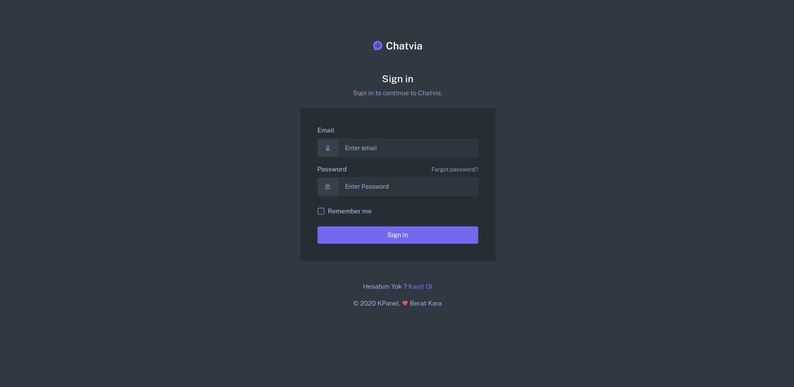
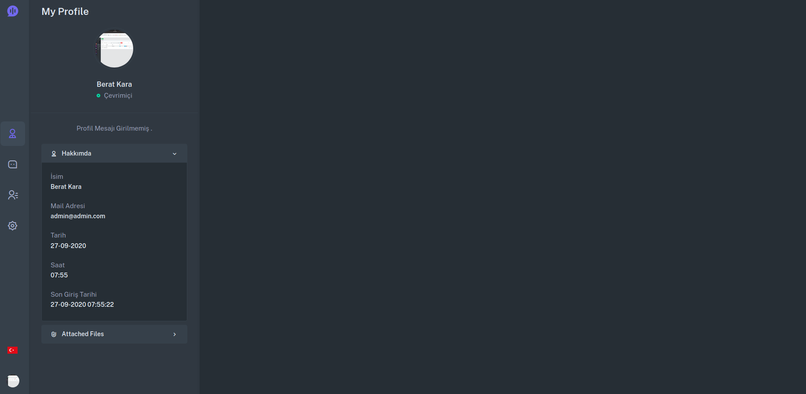
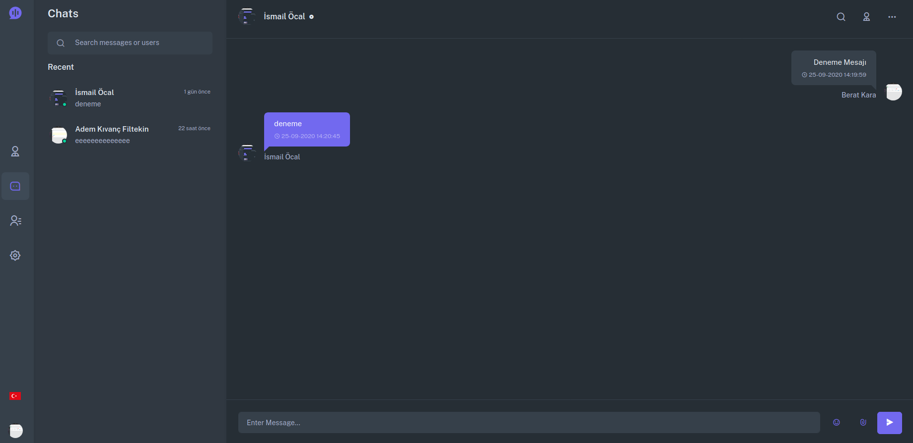
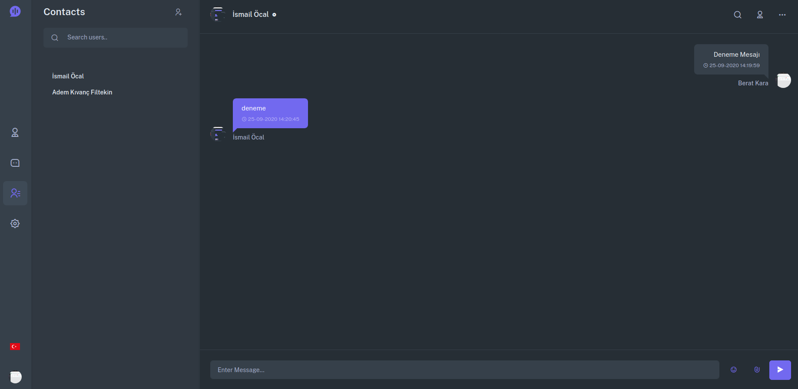
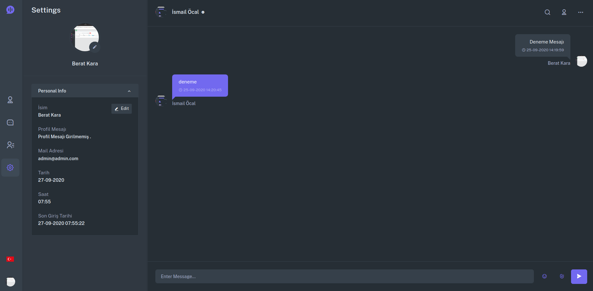

https://github.com/andersao/l5-repository#installation

### Gereklilikler 

### Redis 
~~~~
sudo apt-get install redis-server
sudo systemctl start redis.service
sudo systemctl enable redis.service
~~~~
### Postgresql
~~~~
wget --quiet -O - https://www.postgresql.org/media/keys/ACCC4CF8.asc | sudo apt-key add -
echo "deb http://apt.postgresql.org/pub/repos/apt/ `lsb_release -cs`-pgdg main" |sudo tee  /etc/apt/sources.list.d/pgdg.list
sudo apt -y install postgresql-12 postgresql-client-12
sudo passwd postgres
sudo systemctl start postgresql.service
sudo systemctl enable postgresql.service
~~~~

### Postgresql için gereken eklentiler
````
CREATE EXTENSION pgcrypto;
````

### Yükleme 

````
cp .env.example .env

composer install

npm cache clean --force

npm install

php artisan key:generate

php artisan jwt:secret

````

### Veritabanı Tablolarının Oluşturulması
````
php artisan migrate:fresh --seed
````


### Frontend Derlenmesi
````
npm run watch
````

### Sistemin Çalıştırılması http://127.0.0.1:8000
````
php artisan serve

npm run watch

npx laravel-echo-server start
````

### Örnek Kullanımlar
````
php artisan list

php artisan make:migration create_test_table --create=test

php artisan make:entity Test

php artisan make:controller Api/TestController --api

php artisan make:resource Test
````










